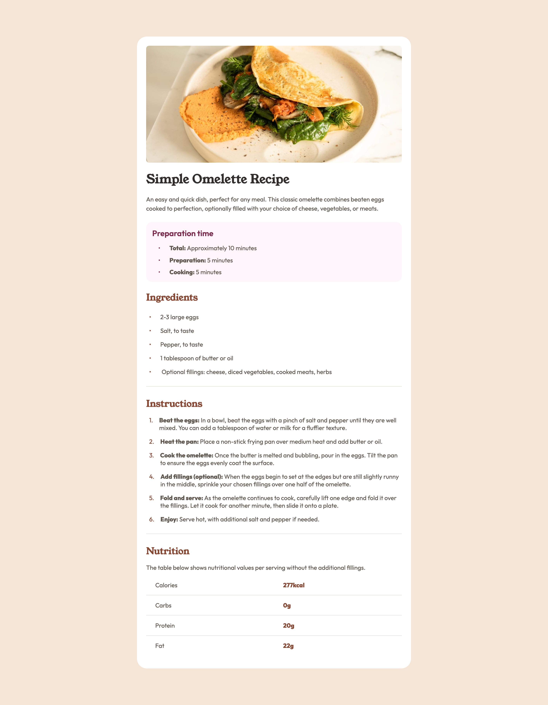

# Frontend Mentor - Recipe page solution

This is a solution to the [Recipe page challenge on Frontend Mentor](https://www.frontendmentor.io/challenges/recipe-page-KiTsR8QQKm). Frontend Mentor challenges help you improve your coding skills by building realistic projects.

## Table of contents

- [Overview](#overview)
  - [Screenshot](#screenshot)
  - [Links](#links)
- [My process](#my-process)
  - [Built with](#built-with)
  - [What I learned](#what-i-learned)
  - [Useful resources](#useful-resources)
- [Author](#author)

## Overview

### Screenshot

### Links

- Solution URL: [Add solution URL here](https://your-solution-url.com)
- Live Site URL: [Add live site URL here](https://your-live-site-url.com)

## My process

### Built with

- Semantic HTML5 markup
- CSS custom properties
- Flexbox
- Mobile-first workflow

### What I learned

Leaned how to properly use flex and mobile-first development, building responsive pages.

### Useful resources

- [MDN Docs - Wrapping and breaking text](https://developer.mozilla.org/en-US/docs/Web/CSS/Guides/Text/Wrapping_breaking_text) - This helped me build the block-style text at the instructions list.
- [MDN Docs - Table basics](https://developer.mozilla.org/en-US/docs/Learn_web_development/Core/Structuring_content/HTML_table_basics) - This helped me with adding the **bottom-border** for each of the table row.

## Author

- Frontend Mentor - [@cosmingradinariu](https://www.frontendmentor.io/profile/cosmingradinariu)
